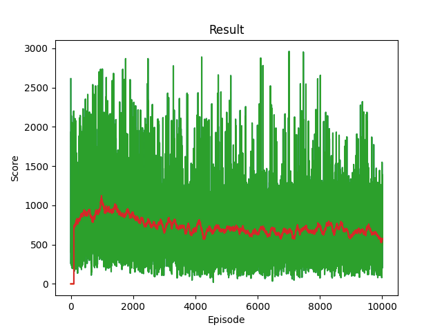
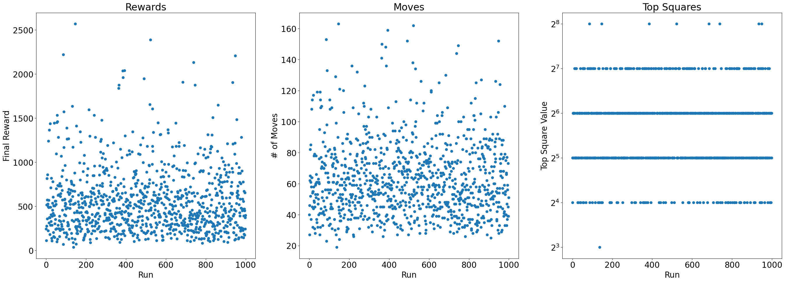
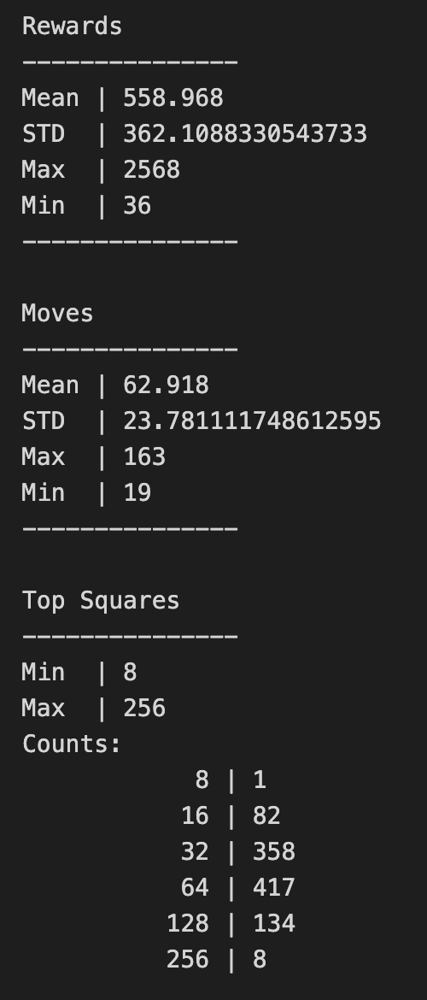

# Solution 1 - Deep Q-Network

## Environment 

The 2048 environment is set up as follows.
In 2048, a 4x4 board of numbers in multiples of 2 and there are 4 possible actions to take, (Left Up, Right, Down). The 4x4 board consists of the entire game state at any point in time. At initialization, the board contains 2 2/4's at any position.

There are 2 kind of moves - Successful and unsuccessful. If a successful move is made, numbers are shifted to their corresponding directions and stacked togethor into a higher multiple of 2. Then, a new 2/4 is randomly placed into an open location.
If an unsuccessful move was made, it meands no numbers could shift and be stacked, and the game state remains the same.

After making each action, there is an associated reward corresponding to the value of the numbers that get stacked. For example, stacking 2 128 blocks gives a score of 256, whereas stacking 2 4 blocks only gives 8. Furthermore, an unsuccessful move is implemented with a reward of -512, attempting to discourage the agent from making them.

The game is played until no successful move can be made.

## Training Method

In my first solution, I took a Deep Q-Learning approach to solving 2048. The implementation of DQN can be found [here](https://pytorch.org/tutorials/intermediate/reinforcement_q_learning.html). Essentially, I try using the policy model to determine the reward of the next possible move, selecting the move that gives the largest possible reward. 

The first iteration model was only trained on 500 episodes, but I anticipate this to be an insufficient number of episodes. Future models will be trained longer.

Training can be run using `python RL/training_simple [-gui] [-eps N]` to train with GUI on or off and plotting.

## Model

The model I use is a simple MLP with 16 input neurons, 1024, 512, 256 hidden neurons, and 4 output neurons. The internal activations are ReLU operations and the output is just left linear. States are flatten to a 16 value vector to be fed into the model and each output neuron corresponds to the reward of a certain move. After doing research on other similar projects, this model is of sufficient size to capture the 2048 problem.

An alternative model that could be used is a convolutional network, since the 4x4 board could be treated like a "grayscale" image.

For an optimization function, I use an Adam algorithm, which was shown to be efficient at converging. However, I am not entirely sure the optimization algorithm matters significantly in this case, so picking Adam is just a heuristic.

For the loss function, I use the Huber Loss, because it take the best traits of MSE and MAE. This way significant losses are punished greater, but not too greatly. I could also just use the plain Huber Loss.

## Results

The training results over episodes is shown as follows. The main performance metric is the final score of the episode. On average, the score is slowly creeping up, around 800. However, it is hard to argue that this performance is any better than pure random strategy.

The test run can be accomplished by running `python scripts/simpleDQN10000_game.py` and observing the results.

I also ran 1000 simulations of the game and observed some statistics regarding the final reward, the total moves, and the top tile score reached.

## Improvement

There are many areas that could be considered for improvement.
First, we might check wheter a convolutional neural network works better. It may or may not, since the weights being multiplied are essentially the same, but it might add a bit of positional relevance.

A more drastic option is to change away from a DQN training method, perhaps using double DQN or Dueling DQNs. Another option is to evaluate the reward of every possible move from a certain state, even perhaps using a Monte Carlo simulation to model the probabilistic nature of new 2/4 blocks.

Lastly, we will train the model for a much longer time and observe whether the results improve even more.

