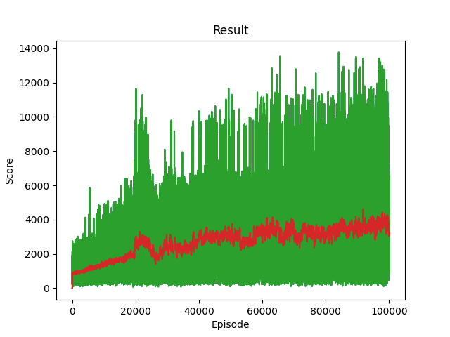
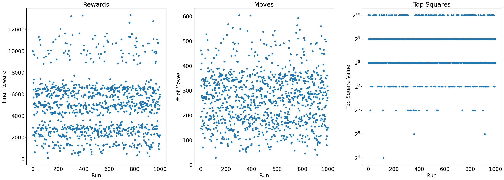
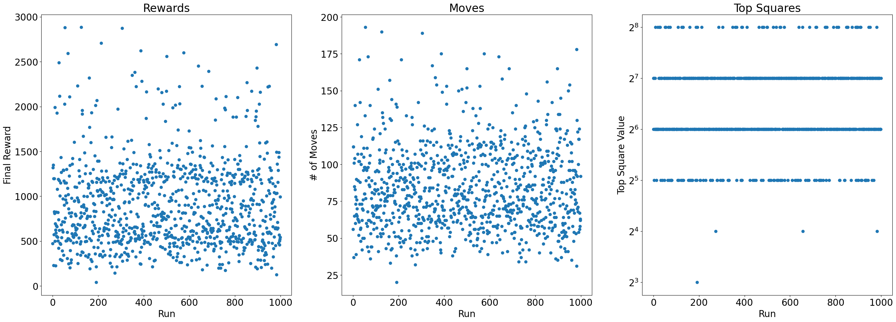
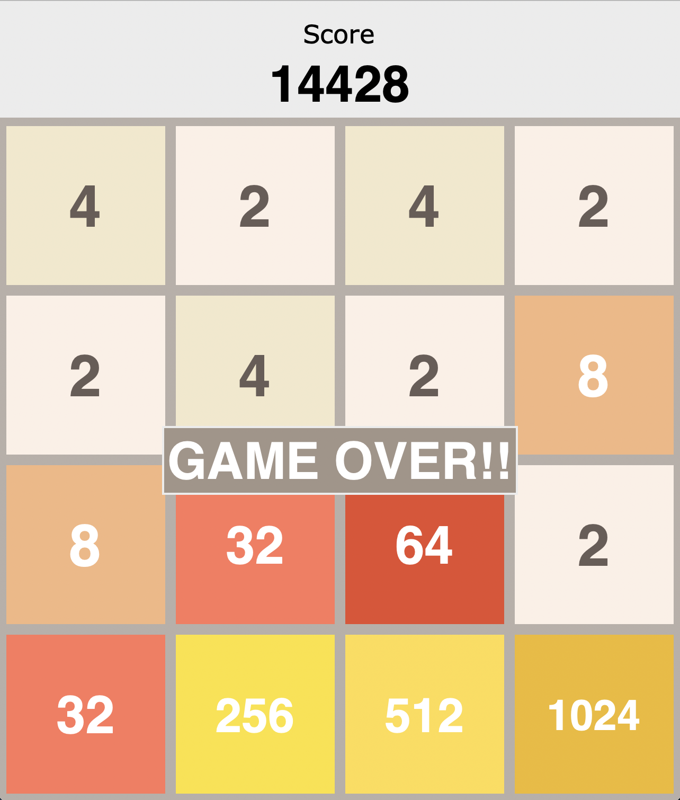

# Solution Final - A Deep Q Network trained by updating every action from a particular state.

## Environment

The environment is set up the exact same way as in [solution1](SOLUTION1.md), with 1 minor change. I include a new option to take a pseudo-step, which outputs the associated next_state and reward for a certain action, but doesn't actually make a modification to the true game state. This enables us to observe the expected result of EVERY action (up, down, left, right) for a single state.

## Model

The model is also identical to the one proposed in [solution1](SOLUTION1.md)

## Improvements Upon Solution 1.

The main improvement from solution 1 is the implementation of a new training method. Previously, I noticed that only taking the reward associated witht the action selected using an epsilon-greedy algorith, the model could not learn at all. This is likely due to the fact that there are a significant number of state configurations, and only updating the policy network with the selected action meant the policy wasn't actually learning to distinguish what the optimal move was. Or if it was, it wasn't converging fast enough. The outputs of the policy network were always roughly the same. Furthermore, if an invalid move was made for a particular state, all the outputted rewards associated with that state would end up negative, similar to the previous noted case.

Therefore, to solve this problem, I implement something similar to a 1-depth Monte Carlo tree search (but no sampling is done). Although it is the case that the next state changes probabilisticly depending on where the new tile spawns, the reward associated with a 1-depth move will always be the same for each action. Hence, I don't run an action more than 1 time. More discussion on this is included in the Further Improvements section.

For every state, I perform a pseudo-step for every possible action, recieving their next-state and reward. Since $Q(s,a) = r + \gamma V(s')$ for a normal DQN, rather than updating the value only for the epsilon-greedy selected action taken, I update $Q(s, a)$ for ALL actions up, down, left, right.

The last improvement I made was also running the sample for a longer period of time of 100k episodes.

## Results

### EveryDQN
The results of my solution are as follows. Initially I ran the training for 10k episodes, but since observing that the model still had further room to improve, I decided to up the training to 100k episodes and only report those values. Values for the 10k sample can be found in `RL/evaluate_performance.ipynb`.

The loss profile for 100k episode is as follows:

The final scores of a 1000 test runs are:

| Metric | Mean | Std | Min | Max |
| ------ | ---- | --- | --- | --- |
| Score  | 4785.09 | 2552.94 | 108 | 13308 | 
| Moves  | 263.33 | 107.52 | 28 | 604 | 
| Top Squares | - | - | 16 | 1024 | 

| Value | Counts |
| ----- | ------ | 
| 16 | 1 | 
| 32 | 2 | 
| 64 | 20 | 
| 128 | 81 | 
| 256 | 276 |
| 512 | 524 | 
| 1024 | 96 |

Compared to the solution 1, we can see that the reinforcement algorithm is actually learning how to play the game. While the reinforcement learning bot was unable to hit 2048, it was capable of reaching 1024 at least a few times, although the majority still hovered around 256 to 512. 

### Simple DQN

Here are results from SOLUTION 1.

The loss profile is as follows:

For 1000 test simulations:

| Metric | Mean | Std | Min | Max |
| ------ | ---- | --- | --- | --- |
| Score  | 558.96 | 362.11 | 36 | 2568 | 
| Moves  | 62.91 | 23.78 | 19 | 163 | 
| Top Squares | - | - | 8 | 256 | 

| Value | Counts |
| ----- | ------ | 
| 8 | 1 | 
| 16 | 82 | 
| 32 | 358 | 
| 64 | 417 | 
| 128 | 134 | 
| 256 | 8 |

### Random

Random as comparison

Using a 1000 simulations of the game, the statistics are as follows:

| Metric | Mean | Std | Min | Max |
| ------ | ---- | --- | --- | --- |
| Score  | 909.85 | 362.11 | 40 | 2884 | 
| Moves  | 84.03 | 27.77 | 20 | 193 | 
| Top Squares | - | - | 8 | 256 | 

| Value | Counts |
| ----- | ------ | 
| 8 | 1 | 
| 16 | 3 | 
| 32 | 97 | 
| 64 | 434 | 
| 128 | 407 | 
| 256 | 58 |

### Human-Played game
Here is my best run at a human-played game of 2048.

The score I got is comparable to the top scores of the RL agent.

## Running Tests

Any of the tests can be run in GUI mode using the following commands.

1. Run `python scripts/interactive_game.py` for the interactive game
2. Run `python scripts/random_game.py` for a game using randomly selected moves
3. Run `python scripts/simpleDQN10000_game.py` for a game using the first iteration of the DQN, trained using the original DQN algorithm for 10k episodes
4. Run `python scripts/everyDQN10000_game.py` for a game using the DQN trained by taking all 4 transitions for a particular state for 10k episodes.
5. Run `python scripts/everyDQN100000_game.py` for the final version of the DQN, trained using the same method as 4. but with 100k episodes.

## Further Improvement

There are a couple options for improvement of the RL algorithm. Although I didn't attempt a different architecture, it may be the case that a CNN or other hyperparameters might result in performance improvements. My choice of an MLP of that size is an arbitrary selection.

Another improvement could be made upon this final iteration of the solution. Rather than just perform 1 of each action, it may be worth it to perform a Monte Carlo sample of each action. This is because although the reward $r$ will still be the same, the next state $V(s')$ may differ. Taking an average of $V(s')$ could improve convergence. However, the space complexity would drastically increase.

To extend this improvement further and have it make more sense, we could do a Monte Carlo Tree search of depth 2 or more. Although the $r$ values of depth 1 is the same, since the next-state is probabilistic, doing a depth 2 would offer different rewards for the 2nd action. However, once again there is a significant tradeoff in space complexity and the time consumed for each iteration.